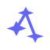

# Constellation Engine Brand Assets

This directory contains the official brand assets for Constellation Engine.

## Logo

The Constellation logo represents the core concepts of the project:

- **Three connected nodes** - Representing a DAG (Directed Acyclic Graph) structure
- **Circular boundary** - Symbolizing the complete, self-contained nature of pipelines
- **Star-like nodes** - Evoking the "constellation" name, where stars (modules) connect to form patterns

### Visual Representation

```
      ●        ← Parent node (data flows from here)
     / \
    ●   ●      ← Child nodes (parallel execution)
```

## Logo Files

### Standard Icons
| File | Description | Use Case |
|------|-------------|----------|
| `logo-icon.svg` | Icon only (indigo on transparent) | Favicons, app icons, small spaces |
| `logo-icon-dark.svg` | Icon only (light indigo) | Dark backgrounds |
| `logo-icon-mono.svg` | Icon only (currentColor) | Inherits text color, flexible theming |

### Negative Icons (inverted)
| File | Description | Use Case |
|------|-------------|----------|
| `logo-icon-negative.svg` | Icon only (white nodes on purple background) | Buttons, badges, emphatic contexts |
| `logo-icon-negative-dark.svg` | Icon only (dark nodes on light background) | Very light backgrounds, high contrast |

### Full Logos
| File | Description | Use Case |
|------|-------------|----------|
| `logo-full.svg` | Icon + wordmark (light background) | Headers, documentation |
| `logo-full-dark.svg` | Icon + wordmark (dark background) | Dark mode headers |

## Color Palette

### Primary Colors

| Name | Hex | RGB | Usage |
|------|-----|-----|-------|
| Indigo 500 | `#6366f1` | `99, 102, 241` | Primary brand color, logo, CTAs |
| Indigo 300 | `#a5b4fc` | `165, 180, 252` | Light variant for dark backgrounds |
| Indigo 700 | `#4338ca` | `67, 56, 202` | Hover states, emphasis |

### Neutral Colors

| Name | Hex | RGB | Usage |
|------|-----|-----|-------|
| Slate 900 | `#0f172a` | `15, 23, 42` | Dark backgrounds |
| Slate 800 | `#1e293b` | `30, 41, 59` | Text on light backgrounds |
| Slate 100 | `#f1f5f9` | `241, 245, 249` | Text on dark backgrounds |
| Slate 50 | `#f8fafc` | `248, 250, 252` | Light backgrounds |

### Semantic Colors

| Name | Hex | Usage |
|------|-----|-------|
| Success | `#22c55e` | Completed nodes, success states |
| Warning | `#f59e0b` | In-progress, warnings |
| Error | `#ef4444` | Failed nodes, errors |
| Info | `#3b82f6` | Information, links |

## Typography

The brand uses system fonts for optimal performance and native feel:

```css
font-family: system-ui, -apple-system, 'Segoe UI', Roboto, sans-serif;
```

For code and technical content:

```css
font-family: 'JetBrains Mono', 'Fira Code', 'SF Mono', Consolas, monospace;
```

## Usage Guidelines

### Do

- Use the logo with adequate spacing (minimum padding equal to the node radius)
- Use the appropriate color variant for the background:
  - Light backgrounds: `logo-icon.svg` or `logo-icon-negative-dark.svg`
  - Dark backgrounds: `logo-icon-dark.svg`
  - Emphasis/badges: `logo-icon-negative.svg`
  - Flexible color contexts: `logo-icon-mono.svg`
- Scale proportionally
- Use the monochrome version when color isn't available
- Use negative icons for buttons, badges, or high-contrast contexts

### Don't

- Stretch or distort the logo
- Change the logo colors outside the provided variants
- Add effects (shadows, gradients, glows) to the logo
- Place the logo on busy backgrounds without contrast
- Rotate the logo

## Minimum Size

- **Icon only**: 16×16px minimum (for favicons), 24×24px recommended
- **Full logo**: 140×32px minimum, 280×64px recommended

## File Formats

All logos are provided as SVG for scalability. For raster formats, export at the following sizes:

| Use Case | Size | Format |
|----------|------|--------|
| Favicon | 16×16, 32×32, 48×48 | PNG, ICO |
| Social preview | 1200×630 | PNG |
| App icon | 512×512 | PNG |
| Print | Vector | SVG, PDF |

## Quick Copy (Inline SVG)

For embedding in HTML without external files:

```html
<!-- 24×24 icon -->
<svg viewBox="0 0 24 24" width="24" height="24">
  <circle cx="12" cy="12" r="10" fill="none" stroke="currentColor" stroke-width="1.5"/>
  <circle cx="12" cy="8" r="2" fill="currentColor"/>
  <circle cx="8" cy="14" r="2" fill="currentColor"/>
  <circle cx="16" cy="14" r="2" fill="currentColor"/>
  <line x1="12" y1="10" x2="8" y2="12" stroke="currentColor" stroke-width="1.5"/>
  <line x1="12" y1="10" x2="16" y2="12" stroke="currentColor" stroke-width="1.5"/>
</svg>
```

## Logo Variations Preview

### Standard Icons

<table>
<tr>
  <td align="center">
    <strong>logo-icon.svg</strong><br/>
    <em>Light backgrounds</em><br/>
    
  </td>
  <td align="center">
    <strong>logo-icon-dark.svg</strong><br/>
    <em>Dark backgrounds</em><br/>
    
  </td>
  <td align="center">
    <strong>logo-icon-mono.svg</strong><br/>
    <em>Flexible theming</em><br/>
    
  </td>
</tr>
</table>

### Negative Icons (Inverted)

<table>
<tr>
  <td align="center">
    <strong>logo-icon-negative.svg</strong><br/>
    <em>Emphasis & buttons</em><br/>
    
  </td>
  <td align="center">
    <strong>logo-icon-negative-dark.svg</strong><br/>
    <em>Very light backgrounds</em><br/>
    
  </td>
</tr>
</table>

### Full Logos with Wordmark

<table>
<tr>
  <td align="center">
    <strong>logo-full.svg</strong><br/>
    <em>Light background</em><br/>
    
  </td>
  <td align="center">
    <strong>logo-full-dark.svg</strong><br/>
    <em>Dark background</em><br/>
    
  </td>
</tr>
</table>

## License

The Constellation Engine logo and brand assets are part of the Constellation Engine project and follow the same license terms.
