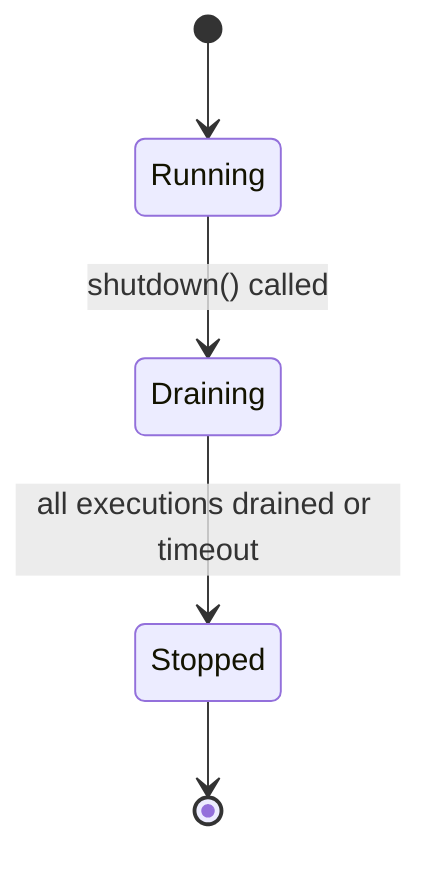

# Graceful Shutdown

Constellation Engine implements a three-phase graceful shutdown that allows in-flight pipeline executions to complete before the process exits. This is critical for Kubernetes deployments where pods receive `SIGTERM` during rolling updates.

## Lifecycle States



| State | New executions | In-flight executions | Health check |
|---|---|---|---|
| **Running** | Accepted | Running | `/health` 200, `/health/ready` 200 |
| **Draining** | Rejected (`ShutdownRejectedException`) | Allowed to complete | `/health` 200, `/health/ready` 503 |
| **Stopped** | Rejected | Cancelled | `/health` 503, `/health/ready` 503 |

## Shutdown Sequence

The shutdown sequence is implemented in `ConstellationLifecycle` (`modules/runtime/.../execution/ConstellationLifecycle.scala`):

### 1. Transition to Draining

```scala
stateRef.modify {
  case (LifecycleState.Running, executions) =>
    ((LifecycleState.Draining, executions), executions)
  case other =>
    (other, other._2)
}
```

The state atomically transitions from `Running` to `Draining`. New calls to `registerExecution()` return `false`, causing the server to reject new requests.

### 2. Wait for In-Flight Executions

```scala
// If no in-flight executions, complete drain immediately
if inflight.isEmpty then
  drainSignal.complete(()).attempt.void
else
  IO.unit
```

If there are no in-flight executions at the time of shutdown, the drain completes immediately. Otherwise, the system waits for each execution to finish. When the last execution completes, `deregisterExecution()` signals the drain:

```scala
case (LifecycleState.Draining, true) =>
  // Last execution drained — signal completion
  drainSignal.complete(()).attempt.void
```

### 3. Timeout and Cancellation

```scala
drainSignal.get.timeoutTo(
  drainTimeout,
  // Timeout: cancel remaining executions
  stateRef.get.flatMap { case (_, remaining) =>
    remaining.values.toList.traverse_(_.cancel)
  }
)
```

If in-flight executions do not complete within `drainTimeout`, remaining executions are cancelled via their `CancellableExecution` handles. This uses Cats Effect 3 fiber cancellation — resources acquired in `Resource` blocks are released in LIFO order.

### 4. Transition to Stopped

```scala
stateRef.update { case (_, executions) =>
  (LifecycleState.Stopped, executions)
}
```

The state transitions to `Stopped`. At this point the HTTP server can close its listener.

## Health Endpoint Behavior

| Endpoint | Running | Draining | Stopped |
|---|---|---|---|
| `GET /health` | 200 `{"status":"ok"}` | 200 `{"status":"ok"}` | 503 `{"status":"stopped"}` |
| `GET /health/live` | 200 | 200 | 200 |
| `GET /health/ready` | 200 | 503 | 503 |

The `/health/ready` endpoint returns 503 during draining so that Kubernetes stops sending new traffic to the pod. The `/health/live` endpoint always returns 200 (the process is still alive, just not accepting work).

## Kubernetes Integration

Configure the pod's `terminationGracePeriodSeconds` to be greater than the drain timeout plus a buffer for SIGTERM delivery and shutdown hook execution:

```yaml
apiVersion: apps/v1
kind: Deployment
spec:
  template:
    spec:
      terminationGracePeriodSeconds: 45  # drainTimeout (30s) + buffer (15s)
      containers:
        - name: constellation
          livenessProbe:
            httpGet:
              path: /health/live
              port: 8080
            periodSeconds: 10
          readinessProbe:
            httpGet:
              path: /health/ready
              port: 8080
            periodSeconds: 5
            failureThreshold: 1  # Remove from service quickly on drain
```

### Shutdown timeline in Kubernetes

```
SIGTERM received
  ├─ readinessProbe fails → pod removed from Service endpoints
  ├─ shutdown() called → state = Draining
  ├─ In-flight executions complete (up to drainTimeout)
  ├─ Remaining executions cancelled (if timeout exceeded)
  ├─ state = Stopped
  └─ Process exits
```

The `failureThreshold: 1` on the readiness probe ensures Kubernetes removes the pod from the Service quickly once draining begins.

## Fiber Cancellation

Each pipeline execution is wrapped in a `CancellableExecution` that holds a reference to the Cats Effect fiber. When cancellation is triggered:

1. The fiber receives a cancellation signal
2. Any `IO` operation currently running is interrupted at its next cancellation boundary
3. Resources acquired via `Resource.make` or `Resource.fromAutoCloseable` are released in LIFO (last-in, first-out) order
4. The execution is deregistered from the lifecycle tracker

This means module implementations that use `Resource` for database connections, HTTP clients, or file handles will have those resources properly cleaned up even during forced cancellation.

## Configuration

The drain timeout is configured when calling `shutdown()`:

```scala
lifecycle.shutdown(drainTimeout = 60.seconds)
```

The default drain timeout is **30 seconds**.

| Parameter | Default | Description |
|---|---|---|
| `drainTimeout` | 30 seconds | Maximum time to wait for in-flight executions to complete before cancelling |

### Choosing a drain timeout

- **Too short** — in-flight executions are cancelled before they complete, potentially leaving external systems in an inconsistent state
- **Too long** — rolling updates take longer than necessary; Kubernetes may `SIGKILL` the pod if `terminationGracePeriodSeconds` is exceeded
- **Recommended** — set drain timeout to your longest expected pipeline execution time, plus a small buffer. Set `terminationGracePeriodSeconds` to drain timeout + 15 seconds.

## Resource Cleanup Order

Constellation uses Cats Effect `Resource` for managing server and runtime lifecycle. Resources are released in LIFO order during shutdown:

1. HTTP server listener (stop accepting connections)
2. Pipeline executions (drain/cancel via lifecycle)
3. Cache backends (flush and close)
4. Metrics reporters (final flush)
5. Thread pools (graceful termination)

This ordering ensures that the server stops accepting traffic before draining executions, and infrastructure resources are released last.
